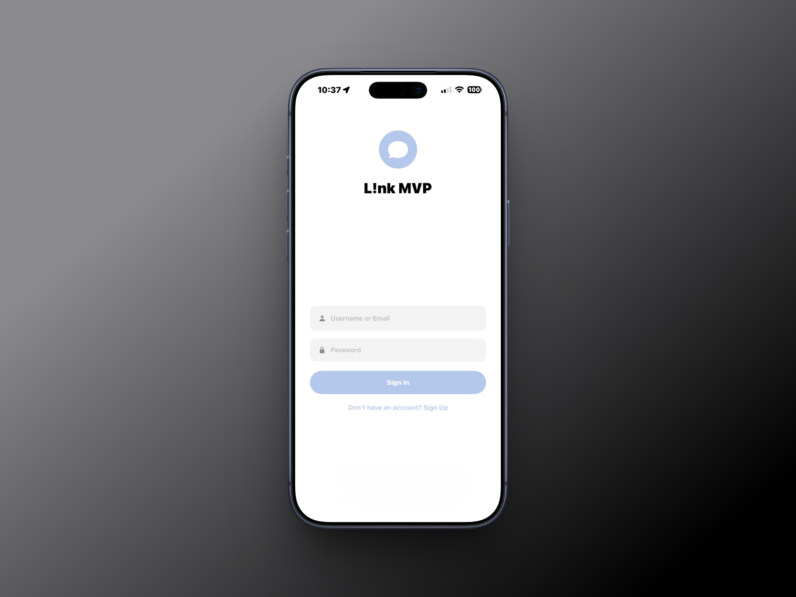
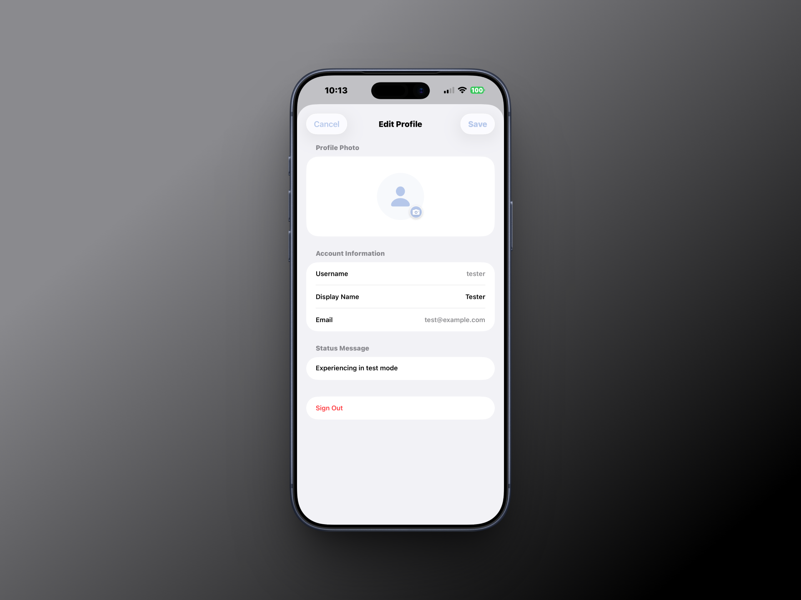
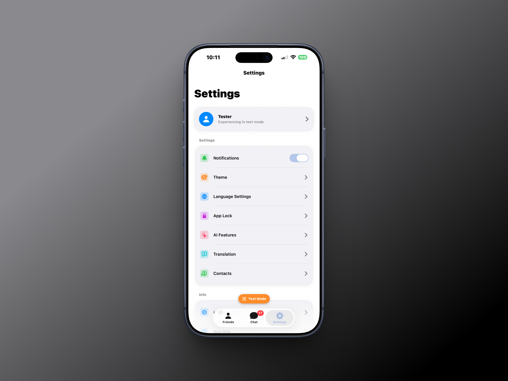
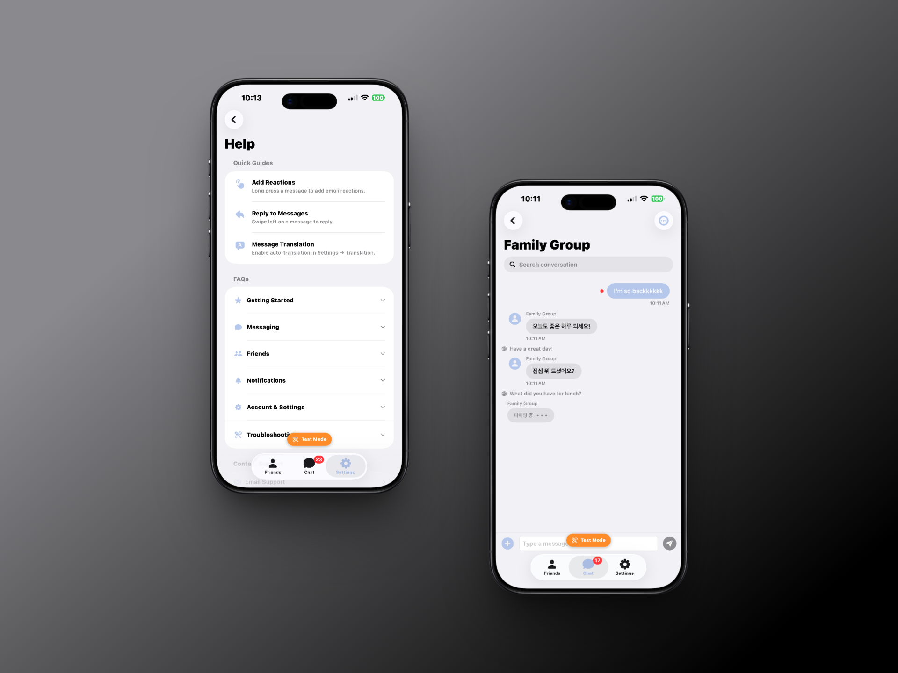

<div align="center">

# L!nk

**Messaging without borders. Minimal by design. Universal by nature.**


<br/>

_A messenger that gets out of your way — and breaks language barriers while it's at it._

<br/>

<!-- Replace with actual screenshot -->



</div>

---

## The Problem

Modern messengers are exhausting.

Buttons everywhere. Tabs you never use. Reactions, stories, channels, bots, stickers — all fighting for your attention before you've even typed a word.

And if you want to talk to someone who speaks a different language? You're copy-pasting into a translation app and back. Every. Single. Time.

---

## The Solution

**L!nk** strips messaging down to what it actually is: two people talking.

Clean interface. No noise. And one feature that changes everything — **real-time auto-translation**, inline, right below every message.

Write in Korean. They write in Japanese. You both read in your own language.
No copy-paste. No switching apps. No awkward pauses.

Just conversation.

---

## Core Feature — Auto Translation

Turn it on once. Forget it's there.

```
┌─────────────────────────────────┐
│  Hola! ¿Cómo estás?             │
│  안녕! 잘 지내?              🌐  │
└─────────────────────────────────┘

┌─────────────────────────────────┐
│  저도 잘 지내요! 오늘 뭐 해요?      │
│  I'm good too! What are you     │
│  up to today?                🌐  │
└─────────────────────────────────┘
```

Every message, automatically translated into your default language — inline, instantly, unobtrusively.

---

## Why "L!nk"

The exclamation mark isn't a typo.

It's the moment of connection — the spark when two people understand each other despite speaking different languages. L!nk is built to create that moment, again and again, for anyone, anywhere.

---

## Features

- **Minimal UI** — only what you need to send a message
- **Auto-translation** — real-time, inline, supports 50+ languages
- **No clutter** — no stories, no reactions, no noise
- **Instant** — translation appears below the original with zero friction
- **Trendy design** — clean, modern, and actually enjoyable to use

---

## Tech Stack

| Layer          | Technology                  |
| -------------- | --------------------------- |
| Language       | Swift 5.9+                  |
| UI Framework   | SwiftUI                     |
| Architecture   | MVVM                        |
| Translation    | Apple Translation Framework |
| Minimum Target | iOS 17+                     |

---

## Screenshots

### Chat View



### Translation On



### Settings



---

## Getting Started

### Requirements

- Xcode 15+
- iOS 17+
- Swift 5.9+

### Installation

```bash
git clone https://github.com/yourusername/link-app.git
cd link-app
open L!nk.xcodeproj
```

Build and run on your simulator or device.

---

## Project Structure

```
L!nk/
├── App/
│   └── L!nkApp.swift
├── Features/
│   ├── Chat/
│   │   ├── ChatView.swift
│   │   ├── ChatViewModel.swift
│   │   └── MessageBubble.swift
│   ├── Translation/
│   │   ├── TranslationService.swift
│   │   └── TranslationToggle.swift
│   └── Settings/
│       └── SettingsView.swift
├── Components/
├── Extensions/
└── Resources/
```

---

## License

MIT © 2026

---

---

<div align="center">

# L!nk

**언어의 경계 없이. 미니멀하게 설계된. 모두를 위한 메신저.**


<br/>

_방해받지 않는 메신저 — 그리고 언어 장벽까지 없애줍니다._

<br/>


</div>

---

## 문제

요즘 메신저는 너무 피곤합니다.

버튼이 넘쳐나고, 쓰지도 않는 탭이 가득하고, 리액션, 스토리, 채널, 봇, 스티커 — 메시지 한 줄 보내기도 전에 이미 지칩니다.

다른 언어를 쓰는 사람과 대화하려면? 번역 앱을 왔다 갔다 하며 복사-붙여넣기를 반복해야 합니다. 매번.

---

## 해결책

**L!nk** 는 메시징을 본질로 되돌립니다: 두 사람의 대화.

깔끔한 인터페이스. 불필요한 요소 없음. 그리고 모든 걸 바꾸는 기능 하나 — **실시간 자동 번역**, 메시지 바로 아래에, 인라인으로.

한국어로 쓰세요. 상대방은 일본어로 답합니다. 둘 다 자신의 언어로 읽습니다.
복사-붙여넣기 없음. 앱 전환 없음. 어색한 침묵 없음.

그냥 대화입니다.

---

## 핵심 기능 — 자동 번역

한 번 켜두면, 있다는 것도 잊게 됩니다.

```
┌─────────────────────────────────┐
│  Hola! ¿Cómo estás?             │
│  안녕! 잘 지내?              🌐  │
└─────────────────────────────────┘

┌─────────────────────────────────┐
│  저도 잘 지내요! 오늘 뭐 해요?      │
│  I'm good too! What are you     │
│  up to today?                🌐  │
└─────────────────────────────────┘
```

모든 메시지가 자동으로 내 기본 언어로 번역 — 인라인으로, 즉시, 조용하게.

---

## 왜 "L!nk" 인가

느낌표는 오타가 아닙니다.

그것은 연결의 순간 — 서로 다른 언어를 쓰는 두 사람이 서로를 이해하는 그 찰나입니다. L!nk는 그 순간을, 누구에게나, 어디서나, 계속 만들어내기 위해 만들어졌습니다.

---

## 주요 기능

- **미니멀 UI** — 메시지 보내는 데 필요한 것만
- **자동 번역** — 실시간, 인라인, 50개 이상 언어 지원
- **노이즈 없음** — 스토리, 리액션, 불필요한 기능 없음
- **즉각적** — 원문 바로 아래에 번역이 표시
- **트렌디한 디자인** — 깔끔하고 현대적이며 쓰기 즐거운 앱

---

## 기술 스택

| 레이어        | 기술                        |
| ------------- | --------------------------- |
| 언어          | Swift 5.9+                  |
| UI 프레임워크 | SwiftUI                     |
| 아키텍처      | MVVM                        |
| 번역          | Apple Translation Framework |
| 최소 타겟     | iOS 17+                     |

---

## 스크린샷

### 채팅 화면


### 번역 켜진 상태


### 설정


---

## 시작하기

### 요구사항

- Xcode 15+
- iOS 17+
- Swift 5.9+

### 설치

```bash
git clone https://github.com/yourusername/link-app.git
cd link-app
open L!nk.xcodeproj
```

시뮬레이터 또는 기기에서 빌드 후 실행하세요.

---

## 프로젝트 구조

```
L!nk/
├── App/
│   └── L!nkApp.swift
├── Features/
│   ├── Chat/
│   │   ├── ChatView.swift
│   │   ├── ChatViewModel.swift
│   │   └── MessageBubble.swift
│   ├── Translation/
│   │   ├── TranslationService.swift
│   │   └── TranslationToggle.swift
│   └── Settings/
│       └── SettingsView.swift
├── Components/
├── Extensions/
└── Resources/
```

---

## 라이선스

MIT © 2026
