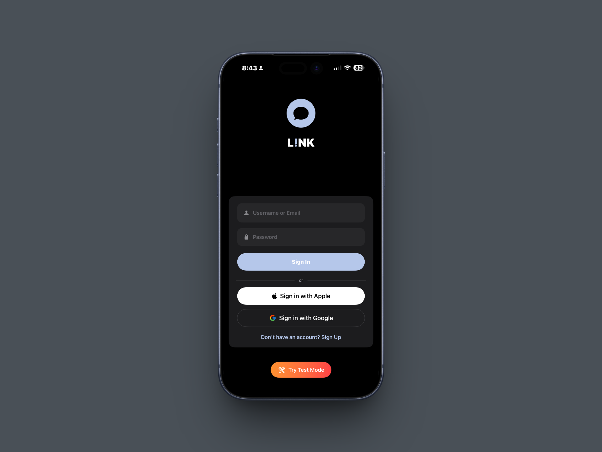
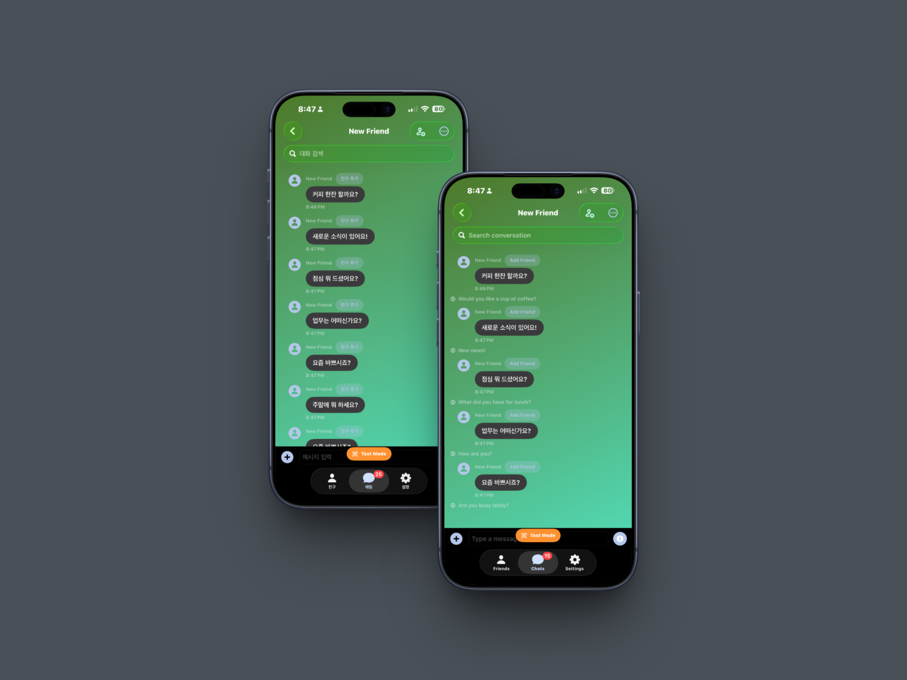
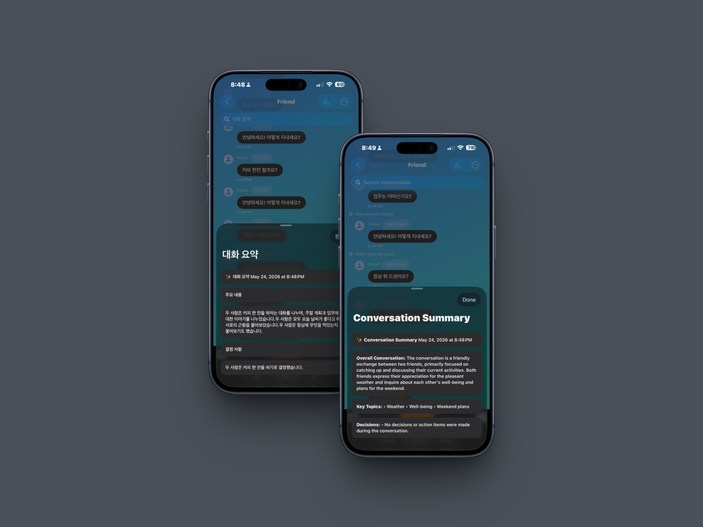
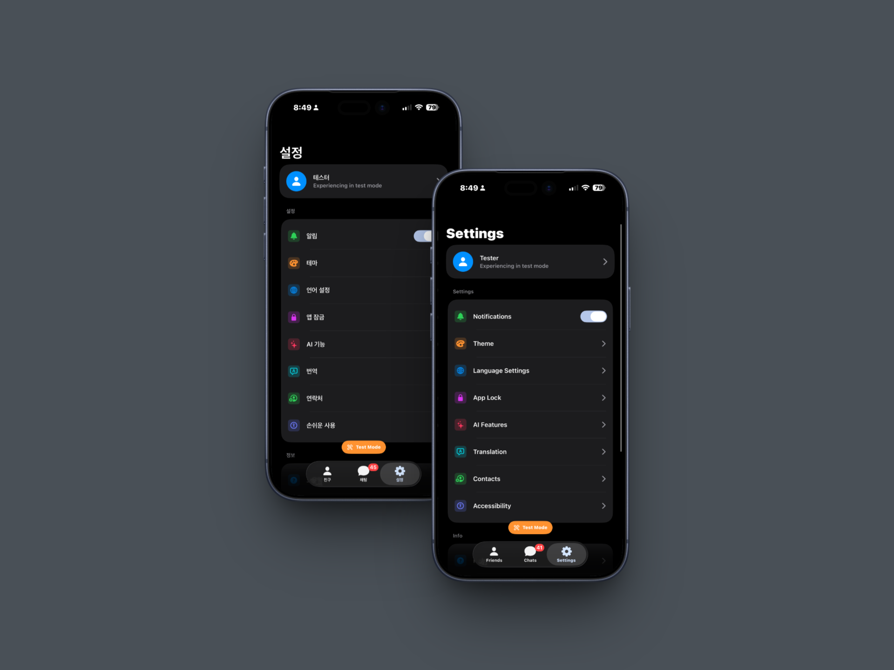
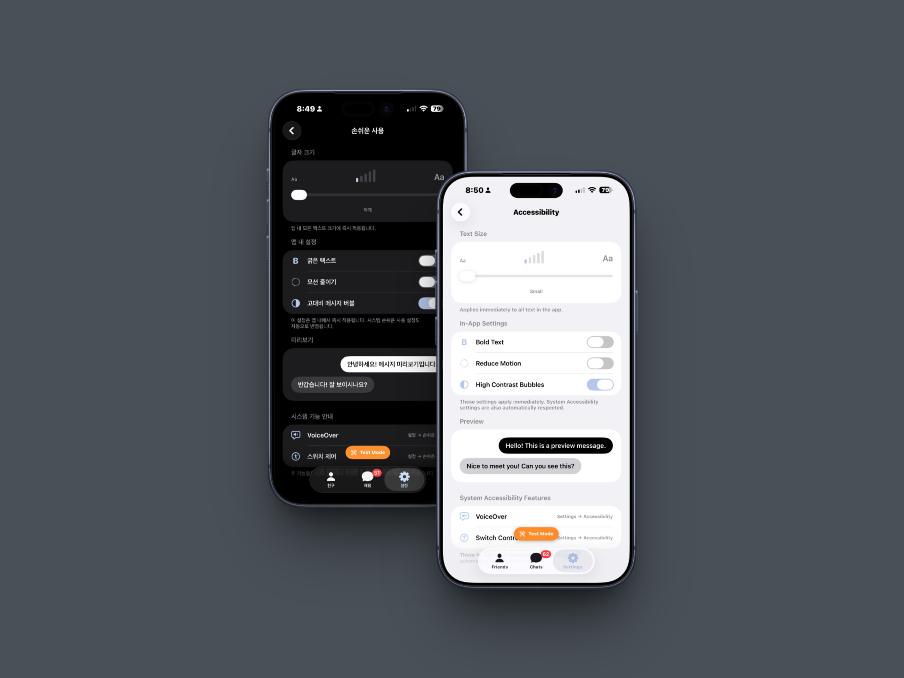
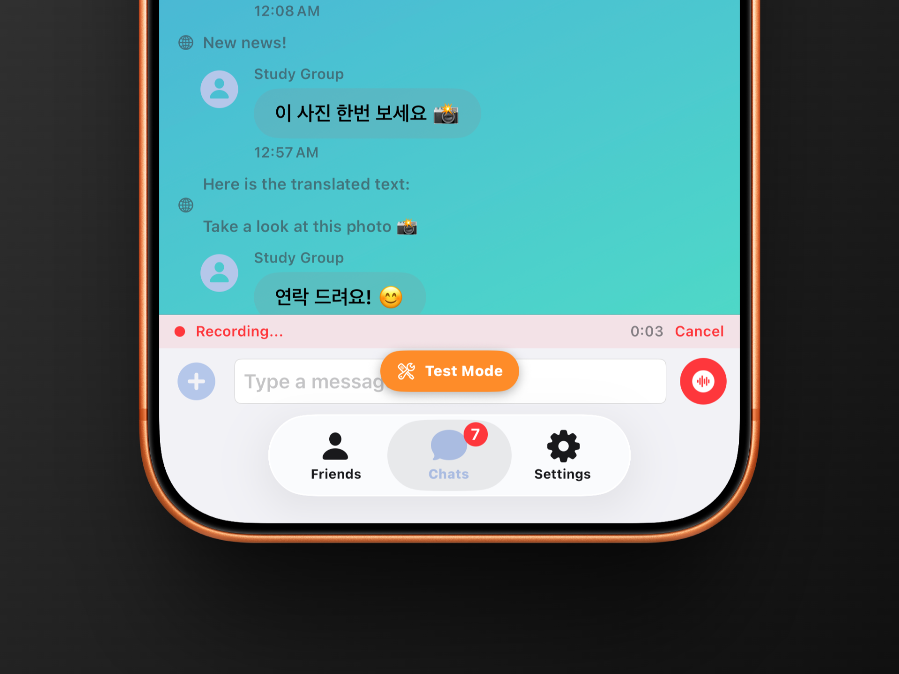

<div align="center">

# L!NK

**Messaging without borders. Minimal by design. Universal by nature.**


<br/>

_A messenger that gets out of your way — and breaks language barriers while it's at it._

<br/>



</div>

---

## The Problem

Modern messengers are exhausting.

Buttons everywhere. Tabs you never use. Reactions, stories, channels, bots, stickers — all fighting for your attention before you've even typed a word.

And if you want to talk to someone who speaks a different language? You're copy-pasting into a translation app and back. Every. Single. Time.

---

## The Solution

**L!NK** strips messaging down to what it actually is: two people talking.

Clean interface. No noise. And one feature that changes everything — **real-time auto-translation**, inline, right below every message.

Write in Korean. They write in Japanese. You both read in your own language.
No copy-paste. No switching apps. No awkward pauses.

Just conversation.

---

## Core Feature — Auto Translation

Turn it on once. Forget it's there.

> Original: Hola! ¿Cómo estás?  
> Translated: 안녕! 잘 지내? 🌐
>
> Original: 저도 잘 지내요! 오늘 뭐 해요?  
> Translated: I'm good too! What are you up to today? 🌐

Every message, automatically translated into your default language — inline, instantly, unobtrusively.

---

## Why "L!NK"

The exclamation mark isn't a typo.

It's the moment of connection — the spark when two people understand each other despite speaking different languages. L!NK is built to create that moment, again and again, for anyone, anywhere.

---

## Features

- **Minimal UI** — only what you need to send a message
- **Auto-translation** — real-time, inline, supports 50+ languages
- **Multi-language app** — Korean, English, Japanese, Chinese, Spanish
- **Voice messages** — hold to record, tap to play, waveform display
- **Link previews** — rich metadata loaded automatically for URLs
- **Read receipts** — checkmark icons showing message delivery and read state
- **AI summary** — on-device conversation summary powered by FoundationModels
- **Reactions & bookmarks** — emoji reactions and bookmarked messages
- **Disappearing messages** — auto-delete after a configurable duration
- **Scheduled send** — queue messages to send at a future time
- **App lock** — Face ID / Touch ID protection
- **Accessibility** — dynamic type, high contrast, screen reader support

---

## Tech Stack

| Layer          | Technology                  |
| -------------- | --------------------------- |
| Language       | Swift 5.9+                  |
| UI Framework   | SwiftUI                     |
| Architecture   | MVVM                        |
| Translation    | Apple Translation Framework |
| Minimum Target | iOS 17+                     |

---

## Screenshots

### Translation



### AI Summary



### Settings



### Accessibility



### Voice Message



---

## Getting Started

### Requirements

- Xcode 15+
- iOS 17+
- Swift 5.9+

---

## Project Structure

The app target has no feature subfolders yet — almost every view/service/model file sits flat inside `TalkMVP/`, with `Repositories/` as the one exception. Five Settings screens also currently live at the repo root rather than inside `TalkMVP/`. This tree reflects the real, current layout:

```
link-mvp/
├── TalkMVP.xcodeproj/
├── TalkMVP/
│   ├── *.swift                  # ~60 files, flat (grouped by feature below)
│   ├── Repositories/
│   │   ├── ChatRoomRepository.swift
│   │   └── MessageRepository.swift
│   ├── Assets.xcassets/         # App icon, color sets, image assets
│   └── Assets/                  # Screenshots used in this README
├── AISettingsView.swift         # ⚠ Settings screens below live at repo root, not inside TalkMVP/
├── NotificationSettingsView.swift
├── SecuritySettingsView.swift
├── SettingsView+Main.swift
├── TranslationSettingsView.swift
├── TalkMVPTests/
│   └── TalkMVPTests.swift
└── TalkMVPUITests/
    ├── TalkMVPUITests.swift
    └── TalkMVPUITestsLaunchTests.swift
```

**By feature** (logical grouping, not physical folders):

- **App**: `TalkMVPApp`, `ContentView`
- **Auth & App Lock**: `AuthView`, `AuthManager`, `SSOSignInView`, `GoogleOAuthService`, `AppLockView`, `AppLockManager`, `AppLockSettingsView`
- **Chat**: `ChatView` (+`Friends`/`Helpers`/`Input`/`Media`/`Messages`/`Sheets`), `ChatViewModel`, `ChatViewAlertModifiers`, `ChatViewSupportingViews`, `ChatListView`, `ChatRoom`, `ChatRoomBackgroundSettings`, `ChatService`/`ChatServiceProtocol`, `Message`, `MessageBubbleView`, `TypingIndicatorView`, `ConnectionStatusView`
- **Friends**: `FriendsView`, `FriendProfileView`, `FriendRowViews`, `FriendManagementViews`, `FriendsListView`, `FriendSearchService`, `AddFriendView`, `OnboardingContactsView`, `ContactsSettingsView`, `ContactsSyncService`
- **Settings**: `SettingsView`(+`Security`), `SettingsCardComponents`, `AccessibilitySettingsView`, `LanguageSettingsView`, `ThemeSettingsView`, `ProfileEditView`, `HelpView`, `TermsPoliciesView`, `AppInfoView`, plus the 5 root-level screens above
- **Services & Managers**: `AIService`, `LocalizationService`, `NotificationManager`, `AutoResponseService`, `VoiceMessageService`, `RealtimeChatManager`, `PermissionManager`, `AttachmentHandler`
- **Localization**: `L10n`, `LanguageManager`(+`Extensions`)
- **Data Layer**: `Repositories/ChatRoomRepository`, `Repositories/MessageRepository`, `User`
- **Shared**: `Colors+Extensions`

---

## License

Copyright © 2026 David Song. All rights reserved.

This repository is shared publicly as a portfolio piece. The source code is not licensed for reuse, redistribution, or derivative works — feel free to read through it, but please reach out if you'd like to discuss using any part of it.

---

---

<div align="center">

# L!NK

**언어의 경계 없이. 미니멀하게 설계된. 모두를 위한 메신저.**


<br/>

_방해받지 않는 메신저 — 그리고 언어 장벽까지 없애줍니다._

<br/>


</div>

---

## 문제

요즘 메신저는 너무 피곤합니다.

버튼이 넘쳐나고, 쓰지도 않는 탭이 가득하고, 리액션, 스토리, 채널, 봇, 스티커 — 메시지 한 줄 보내기도 전에 이미 지칩니다.

다른 언어를 쓰는 사람과 대화하려면? 번역 앱을 왔다 갔다 하며 복사-붙여넣기를 반복해야 합니다. 매번.

---

## 해결책

**L!NK** 는 메시징을 본질로 되돌립니다: 두 사람의 대화.

깔끔한 인터페이스. 불필요한 요소 없음. 그리고 모든 걸 바꾸는 기능 하나 — **실시간 자동 번역**, 메시지 바로 아래에, 인라인으로.

한국어로 쓰세요. 상대방은 일본어로 답합니다. 둘 다 자신의 언어로 읽습니다.
복사-붙여넣기 없음. 앱 전환 없음. 어색한 침묵 없음.

그냥 대화입니다.

---

## 핵심 기능 — 자동 번역

한 번 켜두면, 있다는 것도 잊게 됩니다.

> 원문: Hola! ¿Cómo estás?  
> 번역: 안녕! 잘 지내? 🌐
>
> 원문: 저도 잘 지내요! 오늘 뭐 해요?  
> 번역: I'm good too! What are you up to today? 🌐

모든 메시지가 자동으로 내 기본 언어로 번역 — 인라인으로, 즉시, 조용하게.

---

## 왜 "L!NK" 인가

느낌표는 오타가 아닙니다.

그것은 연결의 순간 — 서로 다른 언어를 쓰는 두 사람이 서로를 이해하는 그 찰나입니다. L!NK는 그 순간을, 누구에게나, 어디서나, 계속 만들어내기 위해 만들어졌습니다.

---

## 주요 기능

- **미니멀 UI** — 메시지 보내는 데 필요한 것만
- **자동 번역** — 실시간, 인라인, 50개 이상 언어 지원
- **다국어 앱** — 한국어, 영어, 일본어, 중국어, 스페인어 지원
- **음성 메시지** — 꾹 눌러 녹음, 탭하여 재생, 파형 표시
- **링크 미리보기** — URL에 대한 풍부한 메타데이터 자동 로드
- **읽음 확인** — 메시지 전송 및 읽음 상태를 체크마크 아이콘으로 표시
- **AI 요약** — FoundationModels 기반 온디바이스 대화 요약
- **리액션 & 북마크** — 이모지 리액션 및 메시지 북마크
- **자폭 메시지** — 설정한 시간 후 자동 삭제
- **예약 전송** — 원하는 시간에 메시지 예약 발송
- **앱 잠금** — Face ID / Touch ID 보호
- **접근성** — 다이나믹 타입, 고대비, 화면 낭독기 지원

---

## 기술 스택

| 레이어        | 기술                        |
| ------------- | --------------------------- |
| 언어          | Swift 5.9+                  |
| UI 프레임워크 | SwiftUI                     |
| 아키텍처      | MVVM                        |
| 번역          | Apple Translation Framework |
| 최소 타겟     | iOS 17+                     |

---

## 스크린샷

### 번역


### AI 요약


### 설정


### 접근성


### 음성 메시지


---

## 시작하기

### 요구사항

- Xcode 15+
- iOS 17+
- Swift 5.9+

---

## 프로젝트 구조

아직 기능별 하위 폴더는 없고, `Repositories/`를 제외한 거의 모든 view/service/model 파일이 `TalkMVP/` 밑에 flat하게 있습니다. Settings 화면 5개는 `TalkMVP/` 밖, 저장소 루트에 위치합니다. 아래는 실제 배치 그대로입니다:

```
link-mvp/
├── TalkMVP.xcodeproj/
├── TalkMVP/
│   ├── *.swift                  # 약 60개 파일, flat (기능별 분류는 아래 참고)
│   ├── Repositories/
│   │   ├── ChatRoomRepository.swift
│   │   └── MessageRepository.swift
│   ├── Assets.xcassets/         # 앱 아이콘, 색상, 이미지 에셋
│   └── Assets/                  # 이 README에 쓰인 스크린샷
├── AISettingsView.swift         # ⚠ 아래 Settings 화면들은 TalkMVP/가 아닌 저장소 루트에 있음
├── NotificationSettingsView.swift
├── SecuritySettingsView.swift
├── SettingsView+Main.swift
├── TranslationSettingsView.swift
├── TalkMVPTests/
│   └── TalkMVPTests.swift
└── TalkMVPUITests/
    ├── TalkMVPUITests.swift
    └── TalkMVPUITestsLaunchTests.swift
```

**기능별 분류** (실제 폴더가 아닌 논리적 그룹입니다):

- **App**: `TalkMVPApp`, `ContentView`
- **Auth & 앱 잠금**: `AuthView`, `AuthManager`, `SSOSignInView`, `GoogleOAuthService`, `AppLockView`, `AppLockManager`, `AppLockSettingsView`
- **Chat**: `ChatView`(+`Friends`/`Helpers`/`Input`/`Media`/`Messages`/`Sheets`), `ChatViewModel`, `ChatViewAlertModifiers`, `ChatViewSupportingViews`, `ChatListView`, `ChatRoom`, `ChatRoomBackgroundSettings`, `ChatService`/`ChatServiceProtocol`, `Message`, `MessageBubbleView`, `TypingIndicatorView`, `ConnectionStatusView`
- **Friends**: `FriendsView`, `FriendProfileView`, `FriendRowViews`, `FriendManagementViews`, `FriendsListView`, `FriendSearchService`, `AddFriendView`, `OnboardingContactsView`, `ContactsSettingsView`, `ContactsSyncService`
- **Settings**: `SettingsView`(+`Security`), `SettingsCardComponents`, `AccessibilitySettingsView`, `LanguageSettingsView`, `ThemeSettingsView`, `ProfileEditView`, `HelpView`, `TermsPoliciesView`, `AppInfoView`, 그리고 위의 루트 소재 5개
- **Services & Managers**: `AIService`, `LocalizationService`, `NotificationManager`, `AutoResponseService`, `VoiceMessageService`, `RealtimeChatManager`, `PermissionManager`, `AttachmentHandler`
- **Localization**: `L10n`, `LanguageManager`(+`Extensions`)
- **데이터 레이어**: `Repositories/ChatRoomRepository`, `Repositories/MessageRepository`, `User`
- **공용**: `Colors+Extensions`

---

## 라이선스

Copyright © 2026 David Song. All rights reserved.

이 저장소는 포트폴리오 목적으로 공개되어 있습니다. 소스 코드의 재사용, 재배포, 2차 저작물 제작은 허용되지 않습니다. 코드를 살펴보시는 것은 자유지만, 일부라도 활용하고 싶으시다면 먼저 연락 주세요.
